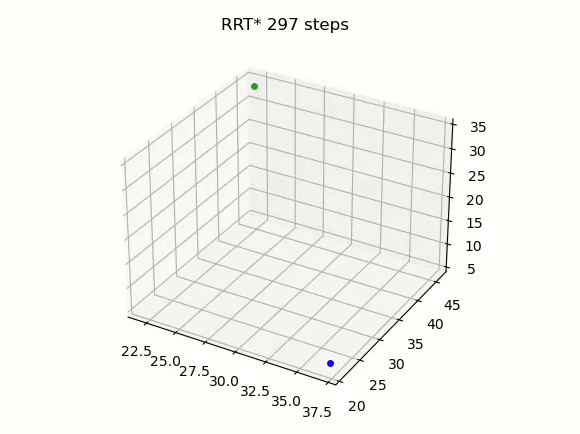

# path_planning

`path_planning` library provides implementations of various path planning algorithms, including RRT and RRT*. More algorithms will be added in the future.

## Getting Started

To use the library, simply follow these steps:

1. Clone the repository to your local machine:

   ```
   git clone https://github.com/bxtbold/path_planning.git
   ```

2. Install the required dependencies:

   ```
   pip install -r requirements.txt
   ```

3. Run the path planning algorithms:

   ```python
   python3 main.py
   ```

## Configuration

You can customize the behavior of the path planning algorithms by editing the `config.yaml` file in the repo directory. Here are the available options:

- `planner`: Specifies the planner to use. Options: `RRT`, `RRT*`.
- `dimensions`: Specifies the dimensions of the space. Options: `2`, `3`.
- `domain`: Specifies the length of the domain for each dimension. (For example, if you set the domain parameter to 50, in a 2D space, the domain would be represented as `(50, 50)`. In a 3D space, the domain would be represented as `(50, 50, 50)`)
- `k`: The maximum number of iterations for the algorithm.
- `step`: The step size for expanding the tree.
- `use_obstacle`: Specifies whether to include obstacles in the environment. Options: `true`, `false`.
- `should_visualize`: Specifies whether to visualize the path planning process. Options: `true`, `false`.


## Example Usage

Here's an example configuration in `config.yaml`:

```yaml
path_planning:
  planner: RRT*
  dimensions: 2
  domain: 50
  k: 1000
  step: 5
  use_obstacle: false
  should_visualize: true
```

This configuration will use the RRT* planner in a 2D space with a domain size of 50x50, running for a maximum of 1000 iterations with a step size of 5. Obstacles will not be included, and visualization will be enabled.

### Example 2D and 3D path planning visualizations
<div style="display: flex;">
    
    
</div>


Feel free to adjust the configuration parameters according to your specific needs.

## Contribution

Contributions to this project are welcome! If you have ideas for improvements or new features, please submit a pull request or open an issue on GitHub.
